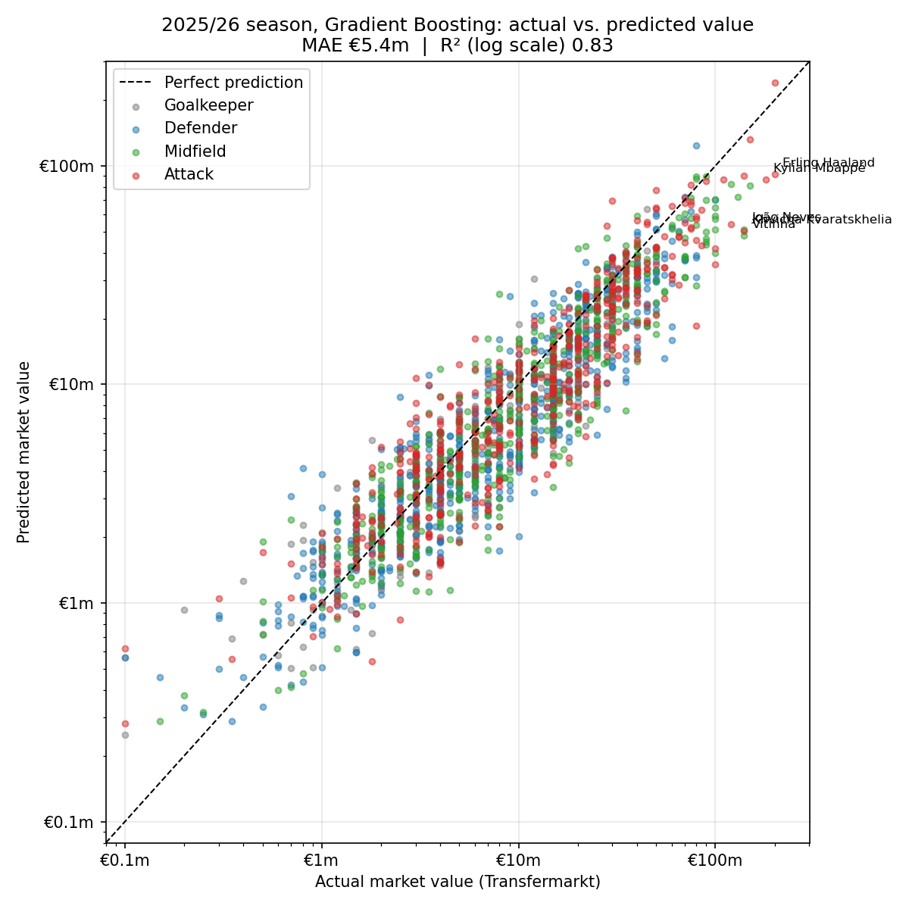
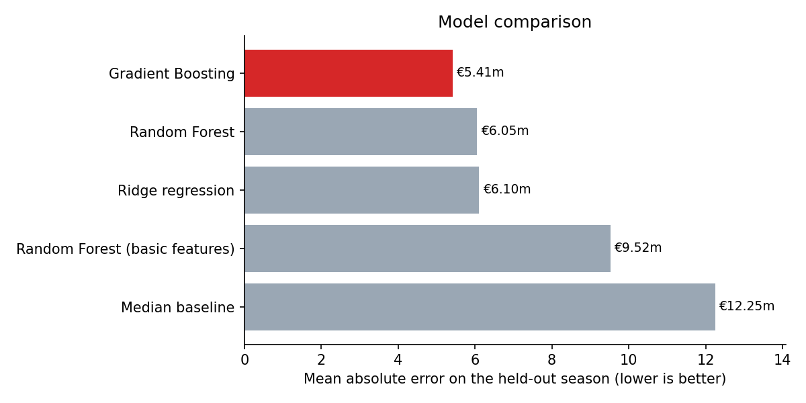
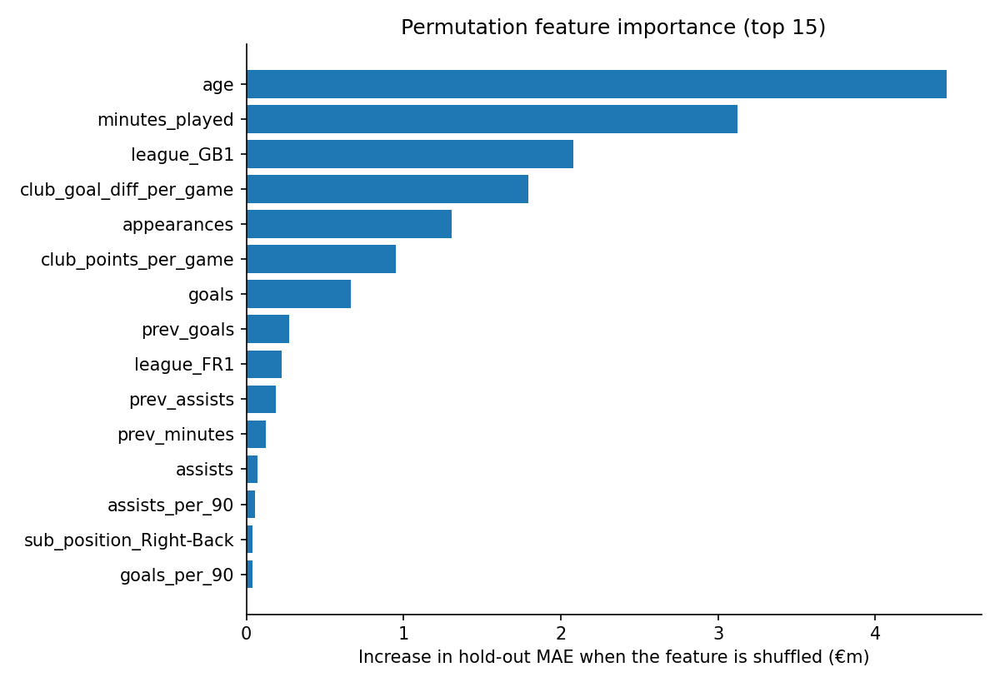

# Football Transfer Value Predictor


Predicts a footballer's market value from one season of statistics across the
top five European leagues. The pipeline downloads Transfermarkt data, builds
player-season features, compares four models with time-based cross-validation,
and serves the best one through a FastAPI service with a React front end.



## Results

Trained on the 2021/22 – 2024/25 seasons (7,800 player-seasons) and tested on
the unseen 2025/26 season (1,964 player-seasons).

| Model | CV MAE | Hold-out MAE | Hold-out R² | Hold-out R² (log) |
| --- | --- | --- | --- | --- |
| Median baseline | €10.90m | €12.25m | -0.19 | -0.01 |
| Random Forest, basic features | €8.46m | €9.52m | 0.27 | 0.47 |
| Ridge regression | €5.72m | €6.10m | 0.63 | 0.79 |
| Random Forest | €5.39m | €6.05m | 0.64 | 0.80 |
| **Gradient Boosting** | **€4.84m** | **€5.41m** | **0.73** | **0.83** |

Gradient Boosting was selected on cross-validation error alone; the hold-out
season was only used for the final score.



What the comparison shows:

- **Features mattered more than the algorithm.** The same Random Forest drops
  from €9.52m to €6.05m error when club strength, previous-season output,
  detailed position and league are added. Even a linear model with the full
  feature set beats a Random Forest with the basic one.
- **Gradient Boosting cuts error by 56% against the baseline** and by 43%
  against the first version of the model.
- **The Premier League is hardest to price** (€8.6m error, against €3.8m for
  Serie A) because its values are the highest and most spread out.



### Limitations

- The target is Transfermarkt's crowd-sourced market value, not an actual
  transfer fee.
- The model still undervalues superstars: Haaland is valued at €200m and
  predicted at €91m. Reputation, contract length and commercial value are not
  in the data.
- Most players appear in several seasons, so the model has usually seen an
  earlier season of a hold-out player. That matches real use (past seasons are
  known), but error on players new to these leagues will be higher.
- A player's previous market value is deliberately not a feature. It would
  dominate the model and turn the task into "predict the change in value".

## Data

All data comes from Transfermarkt via the open
[transfermarkt-datasets](https://github.com/dcaribou/transfermarkt-datasets)
project, downloaded with `requests` (about 60 MB, cached after the first run).

| Table | Used for |
| --- | --- |
| `appearances` | goals, assists, minutes and cards per match |
| `players` | date of birth, position, height |
| `player_valuations` | historical market values (the target) |
| `games` | match results, for club strength |

football-data.org was the original plan, but its API has no market values and
no minutes played.

## Method

1. **Aggregate** league appearances to one row per player per season
   (Premier League, La Liga, Serie A, Bundesliga, Ligue 1). Players who moved
   mid-season are assigned to the club where they played most.
2. **Filter** out player-seasons under 450 league minutes.
3. **Target**: the Transfermarkt valuation closest to the end of the season
   (15 June, ±90 days), modelled as `log(1 + value)` because values are
   heavily right-skewed.
4. **Features** (38):
   - season output: appearances, minutes, goals, assists, cards, goals/90, assists/90
   - previous-season minutes, goals and assists
   - club strength: points and goal difference per game
   - age, height, position, detailed position, league
5. **Model selection** with expanding-window cross-validation: train on all
   earlier seasons, validate on the next. A random split would let the model
   train on the future.
6. **Evaluate** every model once on the held-out latest season.

## Run it

```bash
git clone https://github.com/MrThakar/transfer-value-predictor.git
cd transfer-value-predictor
python -m venv .venv
source .venv/bin/activate        # Windows: .venv\Scripts\activate
pip install -r requirements-dev.txt
python -m transfer_value.train
```

Options:

```bash
python -m transfer_value.train --leagues GB1 --seasons 2022 2023 2024 2025
python -m transfer_value.train --min-minutes 900 --refresh
```

Training writes the charts, `model_comparison.csv`, `test_predictions.csv` and
`metrics.json` to `outputs/`, and the fitted model to `models/model.joblib`.

### Web app

Build the React front end once, then start the server. FastAPI serves both the
API and the built page from one process:

```bash
cd frontend && npm install && npm run build && cd ..
uvicorn transfer_value.api:app
```

Open `http://127.0.0.1:8000`. Pick a position, league and club strength, enter
a season's statistics, and the estimate updates as you type, alongside the
real players valued closest to it.

For front-end development with hot reload, run `uvicorn transfer_value.api:app`
in one terminal and `npm run dev` inside `frontend/` in another, then open
`http://localhost:5173`.

### Prediction API

```bash
curl -X POST http://127.0.0.1:8000/predict \
  -H "Content-Type: application/json" \
  -d '{"age": 24.5, "position": "Attack", "sub_position": "Centre-Forward",
       "league": "GB1", "appearances": 34, "minutes_played": 2900,
       "goals": 18, "assists": 6, "prev_minutes": 2500, "prev_goals": 12,
       "prev_assists": 4, "club_points_per_game": 2.0,
       "club_goal_diff_per_game": 0.9}'
```

```json
{"predicted_value_eur": 84671000.0, "model": "Gradient Boosting"}
```

Interactive docs are at `http://127.0.0.1:8000/docs`. Inputs are validated
with Pydantic; only age, position, appearances and minutes are required.

| Endpoint | Purpose |
| --- | --- |
| `POST /predict` | Predicted market value for one player-season |
| `GET /comparables` | Real players whose actual value is closest to a given value |
| `GET /metadata` | Form options, model name and hold-out accuracy |
| `GET /health` | Liveness check |

### Deploy

The `Dockerfile` builds the front end, trains the model and serves everything
on one port, so any Docker host works (Render, Azure Container Apps, Fly.io):

```bash
docker build -t transfer-value .
docker run -p 8000:8000 transfer-value
```

### Tests

```bash
python -m pytest
```

The 20 tests use small synthetic tables, so they need no network access.
GitHub Actions runs them, and type-checks and builds the front end, on every
push.

## Project structure

```
transfer-value-predictor/
├── transfer_value/
│   ├── config.py        # paths, leagues, constants
│   ├── data.py          # download and load raw tables
│   ├── features.py      # player-season aggregation and feature matrix
│   ├── model.py         # candidate models, time-based CV, scoring
│   ├── plots.py         # matplotlib charts
│   ├── train.py         # command-line pipeline
│   └── api.py           # FastAPI service (API + built front end)
├── frontend/            # React + TypeScript + Tailwind (Vite)
│   └── src/
│       ├── App.tsx      # form, live prediction, comparable players
│       └── api.ts       # typed client for the backend
├── tests/               # pytest suite (features, model, API)
├── Dockerfile           # one image: build front end, train, serve
├── .github/workflows/ci.yml
├── outputs/             # committed charts and metrics
├── requirements.txt
└── requirements-dev.txt
```

## Ideas for improvement

- Add richer metrics (xG, xA, progressive passes) from FBref or Understat
- Add contract length and international caps as of each season
- Tune hyperparameters and try quantile regression for prediction intervals
- Evaluate separately on players new to the dataset
